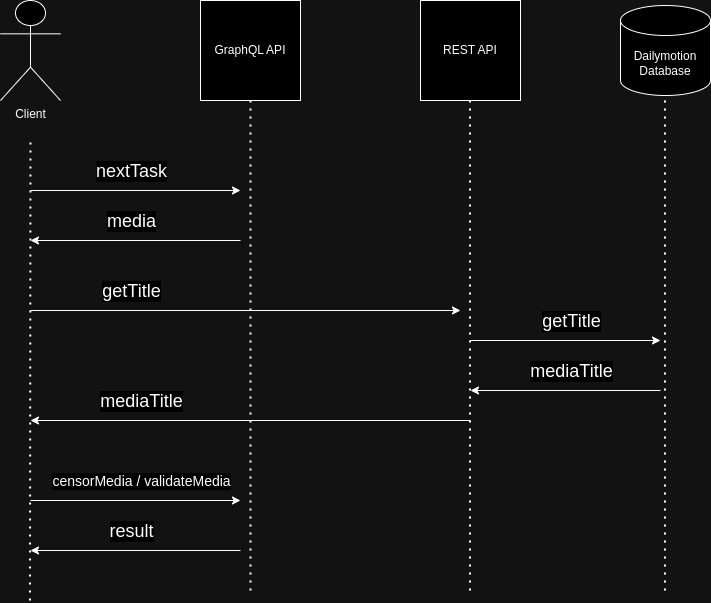

# Dailymoderation

**Dailymoderation** is a client media moderation tool that I have developped with the intention to show my software engineering skills to the technical interviewer.
This tool makes use of a GraphQL API which has been provided in the technical test package.


## Dependencies

- [React Router](https://reactrouter.com/en/main)
- [Redux](https://redux.js.org/)
- [Apollo](https://www.apollographql.com/docs/react/)
- [Vitest](https://vitest.dev/)
- [GNU make](https://www.gnu.org/software/make/manual/make.html)
- [Docker](https://docs.docker.com/)

## How to run with Docker

The build and run process has been tested using **Docker version 24.0.6**

### Production environment

```bash
make run-prod
```

### Development environment

```bash
make run-dev
```

### Run unit tests

```bash
make run-test
```

### Clean the container

```bash
make clean
```

## How to run with NPM

The run process has been tested using **node v18.18.2** and **npm v9.8.1**

### Building for production

```bash
npm run build
#... production files available in ./dist
```

### Development environment

```bash
npm run dev
```

### Run unit tests

```bash
npm run test
```

## Design choices

### Comunication with the GraphQL/REST APIs

The moderation client tool communication with two APIs:

- **GraphQL** : The provided Apollo Server to fetch, censor and validate media.
- **REST**: The public **Dailymotion** API, I used it because the **title** field was missing from the media information returned by the GraphQL API.
  <br>
  <br>



### React Router

I have made the choice to use React Router, firstly to display my skills with this library and also for the following reason:

#### Single Page Application

React Router is perfect to create modern Single Page Application, and it is certain that a media moderation tool will be composed of more than one page (Login, Profile, Logout route, etc.)

#### Better user experience for handling unexpected errors

React Router provides us with a way to add an **Error Element** inside of our routes, thus, displaying a user-friendly error page in case of any unexepected error.

#### Action functions inside the routes

My first approach was to use an [action](https://reactrouter.com/en/main/route/action) function to handle all the API and GraphQL queries and mutations. And for this case, React Router is very handfull and allows us to create some interface between the functionnal components (the vue) and the Rest/GraphQL APIs by acting as some king of controller, which gives us a good way of dealing with separation of concerns.

At the end, I went with another approach because I wanted to make use of the hooks provided by the _@apollo/client_ library and to use a Redux Store to manage a global state, using action function would have forced me to add to much logic inside my[ Moderation Page](src/pages/moderation/Moderation.tsx) functionnal component and make it too much overloaded.

### Custom hook [useMediaModeration](src/hooks/useMediaModeration.tsx)

I decided to use a custom hook to handle the overall media management, fetching, censoring and validating logic. This was motivated by a need to separate concerns inside the [ModerationPage](src/pages/moderation/Moderation.tsx) component.  
It would have been too much overloaded if all the hooks (Redux's hooks, Apollo's hooks, useEffects) would have been inside it.

### Unit tests

I have always been taught that unit tests and test driven developments are a must-have in the software engineering field. This is why I have tried to implements several unit tests available inside the [test](src/__test__/) folder.  
I have been able to succesfully implement simple tests and mocks for testing the [useMediaModeration](src/hooks/useMediaModeration.tsx) custom hook.

## Thanks

Thank you for the time taken to review this project.

Amin GHELIS
